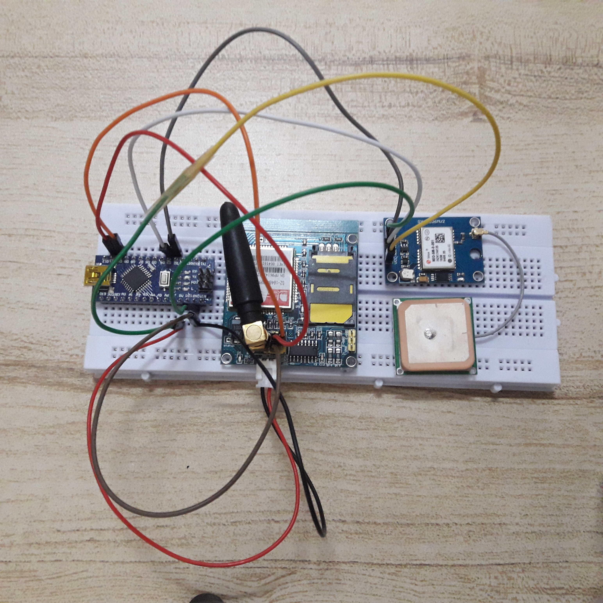
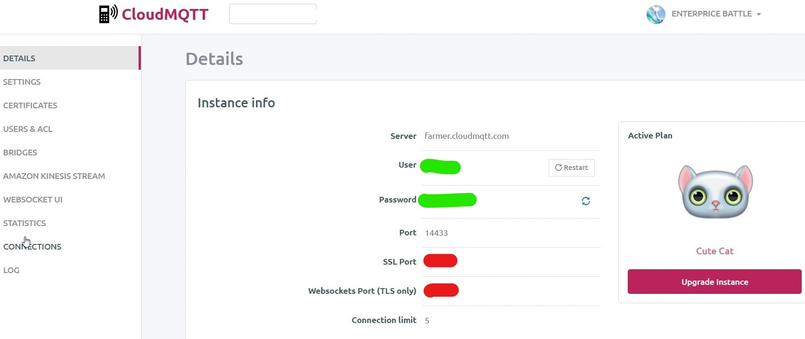

Tracking Device using Arduino
======

### Components I used:
* Arduino Nano
* GSM SIM900A module
* NEO-6 GPS module

### Instructions:
* Clone or download this repo
* Make sure to install TinyGPSPlus - https://github.com/mikalhart/TinyGPSPlus beforehand (it do a lot of hard works for us :) )
* Connect jumpers 

* Edit your script according to your cloudMQTT account

```arduino
const char MQTTHost[30] = "farmer.cloudmqtt.com"; // server name
const char MQTTPort[10] = "14433"; // port number
const char MQTTClientID[20] = "adi"; // anything that unique to the device
const char MQTTTopic[30] = "device1"; // unique topic name

const char MQTTUsername[30] = ""; // instance username.. check in instance's details
const char MQTTPassword[35] = ""; // instance password

GPRS.print("AT+CSTT=\"diginet\",\"\",\"\"\r\n"); //"AT+CSTT=\"<YOUR TELCO APN>\",\"\",\"\"\r\n"
GPRS.print("AT+CIPSTART=\"TCP\",\"farmer.cloudmqtt.com\",\"14433\"\r\n"); //"AT+CIPSTART=\"TCP\",\"<SERVER NAME>\",\"<SERVER PORT>\"\r\n"
```
* Have fun!!

###### Haziq Suhaimi